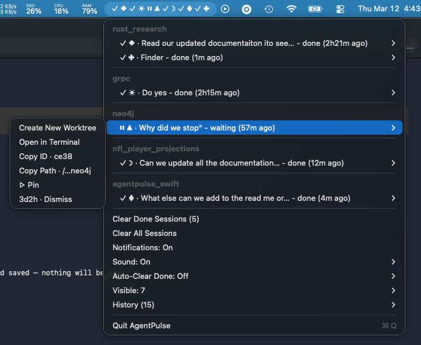

# AgentPulse

Real-time Claude Code session monitor for your macOS menubar.



Zero dependencies — single compiled Swift binary. See every session's status at a glance, click to jump straight to its Terminal tab.

## Install

```bash
git clone https://github.com/enzobelline/agentpulse.git
cd agentpulse
./install.sh
```

This will:
1. Build the Swift binary
2. Configure Claude Code hooks in `~/.claude/settings.json`
3. Optionally install `terminal-notifier` for rich notifications
4. Set up a LaunchAgent for auto-start on login

Or download the latest universal binary (arm64 + x86_64) from [Releases](https://github.com/enzobelline/agentpulse/releases) and run `./install.sh`.

## Uninstall

```bash
./uninstall.sh
```

## What You Get

```
⏸ ◆  ✓ ●  ⠋ ▲  ⠋ ■  …(1)
```

- `⠋` Spinner = running
- `⏸` = waiting for permission
- `✓` = done
- Symbols (◆ ● ▲ ■ ★ etc.) = unique per-session identity
- `…(N)` = additional sessions beyond the visible limit

Sessions needing attention (waiting/done) float to the top.

## Features

- **Click to Attach** — click any session to focus its Terminal tab (matches by TTY, works across Spaces)
- **Live Activity** — see what Claude is doing: "Editing Models.swift...", "Running: git status..."
- **Smart Notifications** — desktop alerts when sessions need input or finish, with click-to-focus
- **Project Grouping** — sessions grouped by directory when multiple projects are active
- **One-Click Worktree** — create a sibling git worktree from any session's submenu
- **Worktree Lineage** — worktree sessions display as `falcon -> myproject`
- **Pin Sessions** — pin important sessions so they always show
- **Session History** — last 50 closed sessions with one-click resume
- **Prompt Capture** — shows your actual prompt text as the session summary
- **Auto-Clear** — done sessions auto-remove after a configurable TTL
- **Configurable Sounds** — per-event sound picker (hover to preview)
- **Single Instance** — duplicate processes detected and prevented automatically

## How It Works

Claude Code hooks (configured in `~/.claude/settings.json`) call `update_status.py` on session lifecycle events. All sessions are written to `~/.claude/session-status.json`. AgentPulse watches this file and updates the menubar in real time (~23ms latency).

The shell wrapper (`run_update_status.sh`) captures the TTY of the Claude CLI process, enabling click-to-attach — AgentPulse finds the exact Terminal tab by matching TTY devices.

## Troubleshooting

**No sessions appearing:**
- Check hooks: `cat ~/.claude/settings.json | grep run_update_status`
- Re-run `./install.sh` to reconfigure
- Logs: `tail -f /tmp/agentpulse.err`

**"Attach" opens new window instead of focusing existing tab:**
- System Settings -> Desktop & Dock -> Mission Control -> "When switching to an application, switch to a Space with open windows" must be ON

**Automation permission not granted:**
- System Settings -> Privacy & Security -> Automation -> Allow AgentPulse to control Terminal.app

## Requirements

- macOS 15+ (Sequoia)
- Swift 6.0+ (Xcode Command Line Tools)
- `terminal-notifier` (optional, for rich notifications) — `brew install terminal-notifier`

## License

[MIT](LICENSE)
