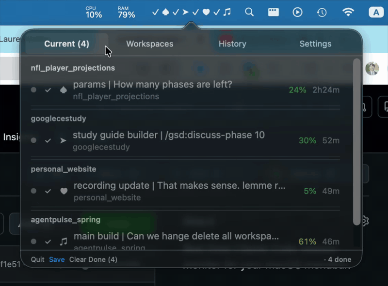

# AgentPulse

Real-time Claude Code session monitor for your macOS menubar.



Zero dependencies — single compiled Swift binary. See every session's status at a glance, click to jump straight to its Terminal tab.

## Install

### Option A — Download the prebuilt `.app` (recommended)

1. Grab `AgentPulse-vX.Y.Z.zip` from the [latest release](https://github.com/enzobelline/agentpulse/releases/latest)
2. Unzip, drag `AgentPulse.app` to `/Applications`
3. One-time configure:

```bash
/Applications/AgentPulse.app/Contents/Resources/configure.sh
```

Add `--yes` to skip prompts.

### Option B — Build from source

```bash
git clone https://github.com/enzobelline/agentpulse.git
cd agentpulse
./install.sh
```

Requires Xcode Command Line Tools (`xcode-select --install`).

Both paths set up the same thing: Claude Code hooks, a LaunchAgent, and the optional `terminal-notifier` integration.

## Uninstall

```bash
./uninstall.sh
```

## What You Get

```
‖ ◆  ✓ ●  ⠋ ▲  ⠋ ■  …(1)
```

- `⠋` Spinner = running
- `‖` = waiting for permission
- `✓` = done
- Symbols (◆ ● ▲ ■ ★ etc.) = unique per-session identity
- `…(N)` = additional sessions beyond the visible limit

Sessions needing attention (waiting/done) float to the top.

## Features

- **Global Hotkey** — `Ctrl+Option+A` toggles the dropdown from anywhere (requires Accessibility permission)
- **Click to Attach** — click any session to focus its Terminal tab (matches by TTY, works across Spaces)
- **Live Activity** — see what Claude is doing: "Editing Models.swift...", "Running: git status..."
- **Session Rename** — give sessions custom names; also updates the Terminal tab title
- **Smart Notifications** — desktop alerts when sessions need input or finish, with click-to-focus
- **Project Grouping** — sessions grouped by directory when multiple projects are active
- **One-Click Worktree** — create a sibling git worktree from any session's submenu
- **Worktree Lineage** — worktree sessions display as `falcon → myproject`
- **Pin Sessions** — pin important sessions so they always show
- **Session History** — last 50 closed sessions with searchable history and one-click resume
- **Auto-Keywords** — extracts file names, tools, and prompt keywords for history search
- **Prompt Capture** — shows your actual prompt text as the session summary
- **Auto-Clear** — done sessions auto-remove after a configurable TTL
- **Configurable Sounds** — per-event sound picker (hover to preview)
- **Single Instance** — duplicate processes detected and prevented automatically
- **Report a Bug** — Settings tab links straight to the GitHub issue tracker

## How It Works

Claude Code hooks (configured in `~/.claude/settings.json`) call `update_status.py` on session lifecycle events. All sessions are written to `~/.claude/session-status.json`. AgentPulse watches this file and updates the menubar in real time.

The shell wrapper (`run_update_status.sh`) captures the TTY of the Claude CLI process, enabling click-to-attach — AgentPulse finds the exact Terminal tab by matching TTY devices.

## Troubleshooting

**Can't see the menubar icon:**
- On MacBooks with a notch, the icon may be hidden behind other menubar items
- Hold `Cmd` and drag it to a visible spot
- Or go to System Settings → Displays → "More Space" for extra menubar room

**No sessions appearing:**
- Check hooks: `cat ~/.claude/settings.json | grep run_update_status`
- Re-run `./install.sh` to reconfigure
- Logs: `tail -f /tmp/agentpulse.err`

**"Attach" opens new window instead of focusing existing tab:**
- System Settings -> Desktop & Dock -> Mission Control -> "When switching to an application, switch to a Space with open windows" must be ON

**Global hotkey not working:**
- System Settings -> Privacy & Security -> Accessibility -> Toggle AgentPulse on
- After granting permission, restart AgentPulse for the hotkey to register

**Automation permission not granted:**
- System Settings -> Privacy & Security -> Automation -> Allow AgentPulse to control Terminal.app

## Requirements

- macOS 15+ (Sequoia)
- Swift 6.0+ (Xcode Command Line Tools)
- `terminal-notifier` (optional, for rich notifications) — `brew install terminal-notifier`

## License

[MIT](LICENSE)
